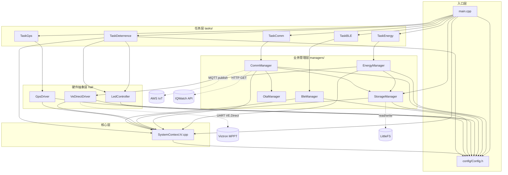
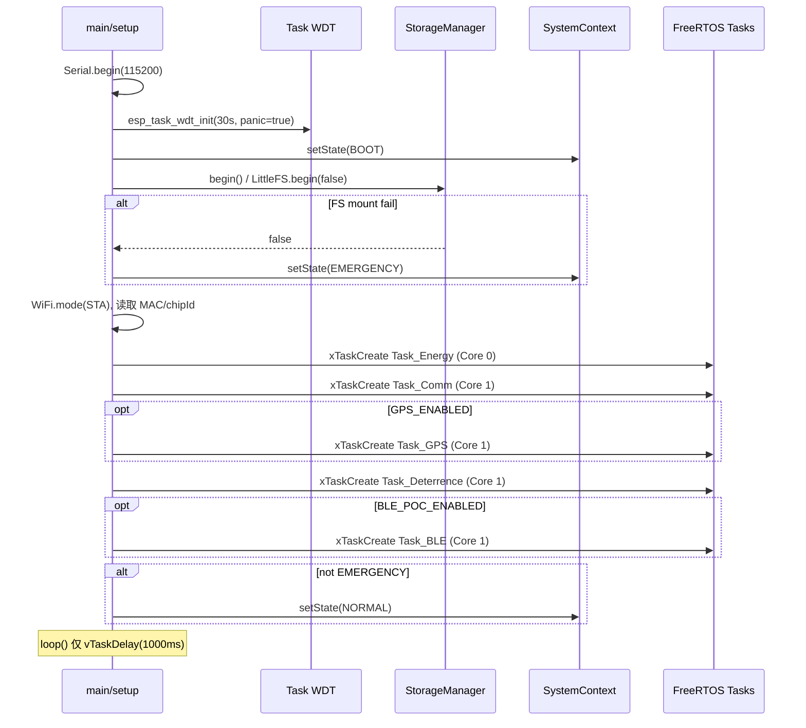

# IQEdge-G2 固件架构审查报告

> **项目路径**: `01-firmware`  
> **扫描基准**: G2 标杆资产（IQEdge V2.3 / FW `v2.2.3.19`）  
> **扫描日期**: 2026-05-28  
> **扫描范围**: `src/`（30 个 `.cpp/.h`）、`include/`（仅 PlatformIO 占位 README）、`platformio.ini`

---

## 0. 执行摘要

本固件采用 **Arduino `setup()` + 空 `loop()` + FreeRTOS 多任务** 架构。业务逻辑不在主循环中运行，而是分布在 5 个可选/必选任务中，通过 **`SystemContext` 单例** 进行线程安全的状态与数据交换。

| 维度 | 结论 |
|------|------|
| 代码组织 | 四层：`config` → `core` → `hal` / `managers` → `tasks` |
| `include/` 目录 | **无项目头文件**，全部为 `src/` 内聚 |
| 双核策略 | Core 0：能源采集；Core 1：通信 / LED / GPS / BLE |
| 云端通道 | WiFi → NTP → TLS 证书（LittleFS）→ AWS IoT MQTT |
| 已知文档差异 | `GEMINI_ESP32.md` 记载的 Wh→kWh `/100` bug **已在当前代码中修复**（现为 `/1000.0`） |

---

## 1. 核心模块拓扑图

### 1.1 分层架构（逻辑视图）

```text
┌─────────────────────────────────────────────────────────────────────────┐
│  main.cpp (setup / loop)                                                │
│    ├─ StorageManager.begin()  ──► LittleFS (证书 / WiFi配置 / 日账本)      │
│    ├─ SystemContext (BOOT → NORMAL | EMERGENCY)                         │
│    └─ xTaskCreatePinnedToCore × N                                       │
└─────────────────────────────────────────────────────────────────────────┘
         │                    │                    │                │
         ▼                    ▼                    ▼                ▼
   Task_Energy          Task_Comm           Task_Deterrence    Task_GPS / Task_BLE
   (Core 0)             (Core 1)            (Core 1)           (Core 1, 可选)
         │                    │                    │
         ▼                    ▼                    ▼
   EnergyManager         CommManager           LedController
         │              ├─ StorageManager            │
         ▼              ├─ OtaManager               │
   VeDirectDriver        └─ AWS MQTT / HTTP API       │
   (Serial2 / VE.Direct)                             │
         │                                           │
         └──────────────► SystemContext ◄─────────────┘
                    (mutex-protected singleton)
```

### 1.2 源文件依赖图（Mermaid）

> 实线箭头 = `#include` 依赖；虚线 = 运行时调用 / 数据流（非 include）。



### 1.3 Include 路径风格对照表

| 引用方目录 | 典型写法 | 示例 |
|-----------|---------|------|
| `src/`（main.cpp） | `"layer/File.h"` | `"config/Config.h"` |
| `src/tasks/` | `"../layer/File.h"` | `"../managers/EnergyManager.h"` |
| `src/managers/` | `"Peer.h"` 或 `"../layer/File.h"` | `"CommManager.h"` / `"../core/SystemContext.h"` |
| `src/hal/` | `"Local.h"` 或 `"../core/..."` | `"VeDirectDriver.h"` |
| `src/core/` | `"SystemContext.h"` + `"../config/Config.h"` | — |

**结论**: 当前 `../` 层级在现有目录结构下 **均可编译**；风险在于 **风格不统一** 与 **头文件 (.h) 内嵌 `../` 路径**（见 §2）。

### 1.4 `include/` 目录状态

`include/` 仅含 PlatformIO 自动生成的 `README`，**无任何 `.h` 实现文件**。全部类型定义与类声明均在 `src/**` 下。搬迁时勿假设存在顶层公共头文件目录。

---

## 2. 搬迁受损潜在风险点

### 2.1 `#include` 相对路径风险（按严重度）

#### 🔴 高风险：头文件内嵌 `../` 路径

以下 **`.h` 文件** 将相对路径暴露给所有下游编译单元。若将头文件或引用方移动到其他目录，**无需改 .cpp 也会编译失败**：

| 文件 | 问题 include |
|------|----------------|
| `tasks/TaskEnergy.h` | `#include "../managers/StorageManager.h"` |
| `tasks/TaskComm.h` | `#include "../managers/StorageManager.h"` |
| `managers/CommManager.h` | `#include "../core/SystemContext.h"` |
| `managers/EnergyManager.h` | `#include "../hal/VeDirectDriver.h"`, `"../core/SystemContext.h"` |
| `managers/StorageManager.h` | `#include "../core/SystemContext.h"` |
| `managers/BleManager.h` | `#include "../core/SystemContext.h"` |
| `hal/VeDirectDriver.h` | `#include "../core/SystemContext.h"` |
| `hal/GpsDriver.h` | `#include "../core/SystemContext.h"` |

**修复建议（搬迁前）**: 在 `platformio.ini` 增加统一 include 根：

```ini
build_flags = -I src
```

并将所有内部引用统一为 `"core/SystemContext.h"`、`"config/Config.h"` 等形式，**消除 `../`**。

#### 🟡 中风险：`main.cpp` 与其他模块风格不一致

- `main.cpp` 使用 `"config/Config.h"`（无 `../`）
- 其余 20+ 文件使用 `"../..."`

搬迁 `main.cpp` 或扁平化 `src/` 时容易遗漏单边修改。

#### 🟢 低风险：同目录 peer include

`managers/CommManager.cpp` → `"CommManager.h"`、`"OtaManager.h"` 等——仅在同目录重组时需要修改。

#### ✅ 当前未发现「层级错乱」的致命错误

全盘扫描 **未发现** `../../` 越级引用或指向不存在路径的 include；现有 `../` 与目录深度匹配，**在现结构下可正常构建**。

---

### 2.2 构建系统缺失文件（搬迁/克隆后必检）

`platformio.ini` 引用以下文件，但 **当前 `01-firmware` 目录内不存在**：

| 引用 | 位置 | 影响 |
|------|------|------|
| `pre:inject_env.py` | `extra_scripts` | 预构建脚本缺失，PlatformIO 可能报错 |
| `partitions/default_4MB_littlefs.csv` | `board_build.partitions` | 分区表缺失，编译/烧录失败 |

> **搬迁检查清单**: 从完整 G2 资产包或 CI 缓存中补齐上述文件，或从 `platformio.ini` 移除/替换引用。

---

### 2.3 硬编码与配置漂移（按类别）

#### A. 网络与云端（`config/Config.h`）

| 符号 | 值 | 风险 |
|------|-----|------|
| `WIFI_SSID` / `WIFI_PASSWORD` | `IQWatch` / `Homaxi2526` | 明文 WiFi 凭据入库 |
| `AWS_MQTT_ENDPOINT` | `a3vcfgcj3um9l2-ats.iot.us-east-1.amazonaws.com` | 环境绑定 |
| `IQWATCH_BASE_URL` | `https://1y9689tax0.execute-api...` | 环境绑定 |
| `MQTT_TOPIC_STATUS` / `CMD` | `device/status`, `device/command` | 协议耦合 |

动态覆盖：`StorageManager` 支持 `/config/wifi.json`；串口命令 `SET WIFI <SSID> <PASS>`（`CommManager::loop`）。

#### B. GPIO / UART 引脚冲突（⚠️ 严重配置漂移）

| 来源 | RX | TX | 说明 |
|------|----|----|------|
| `Config.h` | `VEDIRECT_RX_PIN=16`, `VEDIRECT_TX_PIN=17` | **未在运行时代码中使用** |
| `EnergyManager.cpp` | `4`, `5` | **实际 VE.Direct 引脚**（注释：V2.3 为 GPS 让出 16/17） |
| `GpsDriver.cpp` | `GPS_RX_PIN=33`, `GPS_TX_PIN=32` | 硬编码，未走 `Config.h` |

搬迁或硬件改版时，若只改 `Config.h` **不会改变实际引脚行为**。

#### C. 业务逻辑内魔法数

| 位置 | 硬编码 | 说明 |
|------|--------|------|
| `TaskEnergy.cpp` | `120000UL` | 启动后 2 分钟内 UART 轮询让步窗口 |
| `CommManager.cpp` | `"IQEdge_" + mac` | MQTT Client ID / Thing 名前缀 |
| `CommManager.cpp` | `$aws/things/.../jobs/...` | AWS IoT Jobs 主题模板 |
| `CommManager.cpp` | `time(nullptr) < 1000000` | NTP 未同步判断阈值 |
| `CommManager::_syncTime` | `pool.ntp.org` 等 | NTP 服务器列表 |
| `StorageManager.cpp` | `LEDGER_PATH`, `WIFI_CONFIG_PATH` | LittleFS 路径 |
| `StorageManager.cpp` | `CERT_*_PATH` | 证书文件名（与 Config.h 一致） |
| `BleManager.cpp` | Nordic UART UUID 常量 | BLE 服务 UUID |
| `VeDirectDriver.cpp` | 大量 `VBAT_MIN/MAX` 等 | 帧校验阈值（合理，但未集中配置） |

#### D. 编译标志与功能开关

| 符号 | 当前值 | 影响 |
|------|--------|------|
| `DEBUG_MODE` | `true` | 串口打印完整 MQTT payload |
| `PRODUCTION_VERIFY` | `true` | 用途需与发布流程对齐 |
| `GPS_ENABLED` | `false` | GPS 任务不创建 |
| `BLE_POC_ENABLED` | `false` | BLE 任务不创建 |
| `ENABLE_OTA` | 注释掉 | `TaskComm` 中 ArduinoOTA 块不编译；Jobs OTA 仍可用 |

#### E. 死代码 / 未接线 API

| 符号 | 状态 |
|------|------|
| `SystemContext::requestUrgentPublish()` | **已定义，全项目无调用方** |
| `SystemState::HIBERNATE` / `CONSERVE` | 仅由 SoC 阈值写入上下文，**无对应负载切断逻辑** |
| `Config.h` 中 `VEDIRECT_RX/TX_PIN` | 与 `EnergyManager` 实际引脚 **不一致** |

---

### 2.4 搬迁操作推荐顺序

1. 补齐 `inject_env.py` 与分区表 CSV  
2. 统一 `#include` 为 `-I src` + 无 `../` 风格  
3. 将 `EnergyManager` / `GpsDriver` 引脚迁入 `Config.h` 并删除重复硬编码  
4. 将 WiFi / AWS / API URL 迁入 `inject_env.py` 或 sdkconfig 式构建注入  
5. 全量编译 + 串口验证 VE.Direct 帧与 MQTT payload  

---

## 3. 系统主要生命周期

### 3.1 启动与初始化流（`setup()`）



**要点**:

- 文件系统失败 → `EMERGENCY`，但仍启动任务（LED SOS 由 Deterrence 处理）  
- 正常路径在 `setup()` 末尾即将状态设为 `NORMAL`（**早于** WiFi/MQTT/MPPT 真正就绪）  
- `loop()` 故意为空转，仅让出 CPU  

---

### 3.2 系统状态机（`SystemState`）

定义于 `core/SystemContext.h`：

| 状态 | 进入条件 | 实际行为 |
|------|----------|----------|
| `BOOT` | `setup()` 开始 | 短暂存在 |
| `NORMAL` | FS 正常且 `setup()` 完成；或 SoC > 30% | 全功能；`isSystemHealthy()` 要求此状态 |
| `CONSERVE` | SoC ∈ (15%, 30%] | **仅写入状态/Payload**，无硬件节能 |
| `HIBERNATE` | SoC ≤ 15% | **仅写入状态/Payload**，无 PIR/RTC 实现 |
| `EMERGENCY` | LittleFS 挂载失败 | LED `SOS` 模式；BLE 任务自删 |

**SoC 策略**（`EnergyManager::evaluatePowerPolicy`）:

```text
SoC > 60%  ──► NORMAL
SoC > 30%  ──► NORMAL  (注释：可节流，但未实现)
SoC > 15%  ──► CONSERVE
SoC ≤ 15%  ──► HIBERNATE
```

`EMERGENCY` 下 `evaluatePowerPolicy` 直接 return，不修改状态。

---

### 3.3 上报模式状态机（`ReportingMode`）

与 `SystemState` 正交，控制 MQTT 发布间隔：

| 模式 | 间隔 | 进入条件 |
|------|------|----------|
| `NORMAL` | 5 min | 默认；白天非峰值 |
| `PEAK` | 1 min | `solar_power > 100W` |
| `NIGHT` | 30 min | `solar_voltage < 5V` 且 `power < 0.1W` 持续 15 min（180×5s 计数） |

由 `EnergyManager::evaluatePowerPolicy` 写入 `SystemContext`；`CommManager` 通过 `getDynamicPublishInterval()` 读取。

---

### 3.4 运行时任务循环

#### Task_Energy（Core 0, 10 Hz）

```text
WDT feed
  → [可选] 启动 120s 内且 WiFi↑MQTT↓ 时跳过 UART poll
  → EnergyManager.poll()
       → VeDirectDriver.poll() → 解析帧 → SystemContext 快照
       → MPPT 连接/stale 检测 → setMpptConnected
       → HSDS 日切 → StorageManager.saveLedgerEntry
  → EnergyManager.evaluatePowerPolicy()
       → ReportingMode 切换
       → SystemState 按 SoC 切换
  → delay 100ms
```

#### Task_Comm（Core 1, 4 Hz）

```text
WDT feed
  → 串口 WiFi 配网命令处理
  → _ensureWifi()（退避重连，优先 LittleFS WiFi 配置）
  → _syncTime()（NTP，TLS 前置条件）
  → _ensureMqtt()（加载证书 → connect → 订阅 Jobs）
  → _mqtt.loop()
  → [可选] AWS IoT Jobs OTA → OtaManager → esp_restart
  → publishStatus()（定时 / urgent）
       → _buildPayload() → MQTT publish（无 HTTP API；ledger 仅存 LittleFS）
  → delay 250ms
```

#### Task_Deterrence（Core 1, 50 Hz）

LED 模式解析优先级：

```text
EMERGENCY        → SOS
WiFi 断开        → FAST_BLINK
MQTT 断开        → DOUBLE_BLINK
MPPT 断开        → TRIPLE_BLINK
isSystemHealthy  → SOLID
其他             → SLOW_BLINK
```

`isSystemHealthy` = WiFi ∧ MQTT ∧ MPPT ∧ state==NORMAL。

#### Task_GPS（Core 1, 条件编译, ~100 Hz)

读取 UART1 NMEA → `SystemContext` GPS 快照 → 可选 GPS 授时（系统时间 < 2024 时）。

#### Task_BLE（Core 1, 条件编译)

等待 MQTT 连接后启动 Nordic UART 服务，1 Hz 推送精简 JSON 快照。

---

### 3.5 数据流：MPPT → 云端

```text
Victron MPPT (VE.Direct UART)
    → VeDirectDriver::_parseFrame()
         H19/H20 ×10 → HistoricalData (Wh)
         V/I/VPV/PPV/IL/LOAD → EnergySnapshot
    → SystemContext (mutex)
    → CommManager::_buildPayload()
         Wh / 1000.0 → kWh (JSON history)
    → PubSubClient → AWS IoT topic: device/status
```

**单位链（当前代码，已正确）**:

1. Victron 寄存器 H19/H20：0.01 kWh  
2. `VeDirectDriver`：`wh = raw * 10`  
3. `CommManager`：`kwh = wh / 1000.0`  

---

### 3.6 连接状态与「健康」语义

| 标志 | 设置方 | 含义 |
|------|--------|------|
| `wifiOk` | `CommManager::_ensureWifi` | `WL_CONNECTED` |
| `mqttOk` | `CommManager::_ensureMqtt` | MQTT 已连接并订阅 |
| `mpptOk` | `EnergyManager::poll` | VE.Direct 帧未 stale（< 60s） |
---

## 4. 源文件职责速查

| 文件 | 职责 |
|------|------|
| `main.cpp` | 启动、WDT、任务创建、全局 `StorageManager` |
| `config/Config.h` | 引脚、WiFi、AWS、时序、任务栈/优先级、功能开关 |
| `core/SystemContext.*` | 状态机、快照、连接标志、自适应上报间隔 |
| `hal/VeDirectDriver.*` | VE.Direct 协议解析、SoC 电压估算、数据校验 |
| `hal/LedController.*` | 状态 LED 模式动画 |
| `hal/GpsDriver.*` | GPS NMEA、授时 |
| `managers/EnergyManager.*` | 能源轮询、SoC 策略、日切账本 |
| `managers/CommManager.*` | WiFi/MQTT/NTP/配网/OTA Jobs/Payload |
| `managers/StorageManager.*` | LittleFS、证书、WiFi JSON、30 日 ledger |
| `managers/OtaManager.*` | HTTPS OTA（esp_https_ota） |
| `managers/BleManager.*` | BLE PoC 遥测 |
| `tasks/Task*.cpp` | FreeRTOS 入口、WDT 注册、调用 Manager |

---

## 5. 关联文档

| 文档 | 路径 | 用途 |
|------|------|------|
| AI 开发红线 | `src/GEMINI_ESP32.md` | 历史 bug、LittleFS 禁忌、双核规则 |
| Payload 样例 | `src/payload.md` | v1/v2 JSON 字段参考 |
| 本报告 | `docs/G2_Architecture_Review.md` | 架构、搬迁风险、生命周期 |

---

## 6. 审查结论

1. **架构清晰**：单例上下文 + 分层 Manager/Task，双核隔离符合 G2 设计意图。  
2. **搬迁首要风险**：头文件内 `../` 路径不统一、引脚配置漂移、`platformio.ini` 外链文件缺失。  
3. **生命周期完整**：启动 → 多任务并行 → 能源/通信/指示三条主线通过 `SystemContext` 解耦。  
4. **待完善能力**：`CONSERVE`/`HIBERNATE`/`requestUrgentPublish` 尚为「状态标签」级实现，未驱动硬件节能或紧急上报。

---

*文档生成：Agent 007 全盘扫描 · IQEdge-G2 Baseline*
