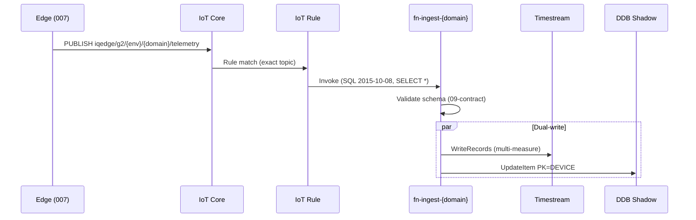

# G2 云架构设计（Cloud Architecture Design）

> **作者视角**: Agent 008 · 资深云服务架构  
> **版本**: v0.1 · 2026-05-29  
> **状态**: 设计基线 — 待 Bob 评审后进入 CDK 实现  
> **前置**: [`008_Strategic_Guide.md`](008_Strategic_Guide.md) · [`G2_Domain_Map.md`](G2_Domain_Map.md) · [`G2_Cloud_Deployment_Audit_2026-05-29.md`](G2_Cloud_Deployment_Audit_2026-05-29.md)

---

## 1. 设计目标与非目标

### 1.1 目标

| # | 目标 | 度量 |
|---|------|------|
| G1 | **双轨并存** — Legacy 零改动，G2 全新隔离 | Legacy Rule/表 0 变更；G2 独立 Stack |
| G2 | **五域规范** — Topic / 表 / API 一一对应 | 100% 资源名符合 Domain Map |
| G3 | **IaC 一键部署** — dev/prod 可重复 | `cdk deploy -c env=dev` 全栈就绪 |
| G4 | **读写分离** — 热路径 ingest 轻、查询走 backend | IoT→Lambda P99 < 500ms；API 与 ingest 解耦 |
| G5 | **可观测 + 可成本控** | 每域独立 Dashboard；Timestream 保留策略分域 |

### 1.2 非目标（明确不做）

- ❌ 迁移 70 台老设备或改造 `DeviceLatestStatus` / `DeviceStatusToLambda`
- ❌ 单 Topic `#` catch-all Rule（Legacy 审计已证风险）
- ❌ 在 Timestream 存 vision 二进制（视频/图片走 S3）
- ❌ Phase 1 即多账号 Landing Zone（可路线图，非 MVP）

---

## 2. 架构总览

### 2.1 逻辑分层

```text
┌─────────────────────────────────────────────────────────────────────────┐
│  Layer 5 · Experience                                                   │
│    Web / Mobile App / AI Agent  ──►  02-backend (FastAPI)  /api/v2/*    │
└─────────────────────────────────────────────────────────────────────────┘
                                    │
                    ┌───────────────┴───────────────┐
                    ▼                               ▼
         ┌──────────────────┐            ┌──────────────────┐
         │  G2 Read Path    │            │  Legacy Read Path │
         │  Timestream +    │            │  DDB DeviceLatest │
         │  DDB Shadow      │            │  Status + old API │
         └──────────────────┘            └──────────────────┘
                    ▲                               ▲
┌───────────────────┴───────────────────────────────┴───────────────────────┐
│  Layer 4 · Storage                                                       │
│    Timestream iqedge_g2_{env}_database  (5 tables, 1 per domain)        │
│    DynamoDB iqedge-g2-{env}-table-shadow  (latest snapshot)             │
│    DynamoDB iqedge-g2-{env}-table-registry  (device → track routing)    │
│    S3 iqedge-g2-{env}-vision-assets  (images / clips metadata)          │
└─────────────────────────────────────────────────────────────────────────┘
                                    ▲
┌───────────────────────────────────┴─────────────────────────────────────┐
│  Layer 3 · Processing (Lambda)                                           │
│    iqedge-g2-{env}-fn-ingest-{domain}   telemetry normalize + dual-write│
│    iqedge-g2-{env}-fn-control-dispatch  command → IoT Jobs / publish    │
│    iqedge-g2-{env}-fn-network-xor       POE 死机推导 (Phase 2)          │
└─────────────────────────────────────────────────────────────────────────┘
                                    ▲
┌───────────────────────────────────┴─────────────────────────────────────┐
│  Layer 2 · Routing (IoT Rules — 精确 Topic，禁止 #)                      │
│    iqedge-g2-{env}-rule-energy      SELECT … FROM 'iqedge/g2/{env}/energy/telemetry'   │
│    iqedge-g2-{env}-rule-network     …/network/telemetry                                  │
│    iqedge-g2-{env}-rule-vision      …/vision/event                                       │
│    iqedge-g2-{env}-rule-environment …/environment/telemetry                              │
│    iqedge-g2-{env}-rule-control     …/control/command  (audit log ingest)                │
└─────────────────────────────────────────────────────────────────────────┘
                                    ▲
┌───────────────────────────────────┴─────────────────────────────────────┐
│  Layer 1 · Edge (007 固件 / RUT / Camera)                                │
│    MQTT over TLS · X.509 · per-Thing Policy · 五域 Topic publish         │
└─────────────────────────────────────────────────────────────────────────┘
```

### 2.2 双轨物理隔离

```text
                    ┌─────────────────┐     ┌─────────────────┐
  Legacy Devices    │  device/status  │────►│ DeviceStatus    │──► DeviceLatestStatus
                    │  iot/rut241/*   │     │ ToLambda (不动) │
                    └─────────────────┘     └─────────────────┘

                    ┌─────────────────┐     ┌─────────────────┐
  G2 Devices        │ iqedge/g2/{env}/│────►│ G2 Domain Rules │──► Timestream (5 tables)
                    │ {domain}/*      │     │ + Ingest Lambdas│──► DDB Shadow
                    └─────────────────┘     └─────────────────┘
                                                      │
                                                      ▼
                                            02-backend Registry Router
```

**关键设计决策**: Legacy 与 G2 **共享同一 IoT Core 账户与 Endpoint**，但 **Rule / 存储 / API 完全分离**。这比新建 AWS 账号成本低，且满足 Bob「不折腾老架构」原则。prod 硬隔离可通过 **独立 Stack + IAM Boundary + 独立 Timestream DB** 实现；账号级隔离列为 Phase 5。

---

## 3. CDK Stack 拆分（最佳实践）

采用 **小而专** 的 Stack，避免单体 Stack 部署慢、回滚面大。

| Stack | 职责 | 部署频率 |
|-------|------|----------|
| `G2FoundationStack` | KMS、SSM 参数、共享 IAM 角色模板、IoT Policy 基类 | 低 |
| `G2RegistryStack` | Device Registry DDB、Provisioning Hook（可选） | 低 |
| `G2IngestStack` | 5× IoT Rule + 5× Ingest Lambda + EventSourceMapping | 中 |
| `G2StorageStack` | Timestream DB + 5 tables、DDB Shadow、S3 vision bucket | 低 |
| `G2ControlStack` | IoT Jobs 模板、control dispatch Lambda、OTA S3 引用 | 中 |
| `G2ObservabilityStack` | CloudWatch Dashboard、Alarms、Log retention | 中 |
| `G2ApiStack`（可选） | API Gateway 仅当 02-backend 不托管在 ECS 时 | 低 |

```text
04-cloud/cdk/
  bin/app.ts                    # -c env=dev|prod
  lib/
    stacks/                     # 上表各 Stack
    constructs/
      DomainIngestPipeline.ts   # Rule + Lambda + IAM 可复用 Construct
      TimestreamDomainTable.ts
    config/
      domains.ts                # 五域常量（Topic/API/表名单一来源）
      naming.ts                 # iqedge-g2-{env}-* 命名函数
```

**命名单一来源（Single Source of Truth）**: `domains.ts` 导出五域配置，CDK / 文档 / 未来 OpenAPI 均引用，避免 Rule 名与表名漂移。

---

## 4. 数据流设计（按域）

### 4.1 上行 Telemetry（energy / network / environment）



**Lambda 职责边界**（保持轻量，< 128MB / 3s）:

1. JSON Schema 校验（`09-contract/schemas/{domain}/`）
2. 单位归一（energy: Wh→kWh `/1000.0`）
3. Timestream `WriteRecords` + DDB `UpdateItem`
4. **不做** 复杂聚合、AI 推理、跨域 JOIN

重计算下沉到 **02-backend 读时聚合** 或 **Phase 2 批处理 Lambda**。

**Smart Backfill（断网补回）**: X1 本地 WAL → 重连批量写入；ingest 须用 **`event_time`** 作 Timestream 时间戳 + **`ingest_mode=backfill`** 幂等。详见 [`G2_Smart_Backfill_Architecture.md`](G2_Smart_Backfill_Architecture.md)。

### 4.2 Vision（event + VQA + Backfill）

| 数据类型 | 存储 | 原因 |
|----------|------|------|
| 事件元数据 + **VQA telemetry** | Timestream `table_vision` + DDB shadow | `vision/event` + `vision/telemetry`；见 Domain Map VQA 节 |
| 图片 / 视频二进制 | S3 `iqedge-g2-{env}-vision-assets` | Timestream 不适合 blob |
| 预签名 URL | 02-backend `/api/v2/vision/stream` 签发 | 前端不直连 S3 |

Payload 模式: MQTT event 只带 `{ "s3_key": "…", "event_type": "motion", … }`。

### 4.3 Control（下行 + 审计）

```text
App/API  POST /api/v2/control/execute
    → 02-backend 鉴权 + 校验
    → fn-control-dispatch
        ├─► IoT Data Plane: Publish → iqedge/g2/{env}/control/command
        └─► Timestream table_control_logs + DDB shadow (command audit)

Device ACK / Job status
    → device publish 或 Jobs notification
    → iqedge-g2-{env}-rule-control (ingest ACK)
    → table_control_logs
```

**OTA 边界建议**: Jobs OTA 保留 AWS IoT Jobs 原生通道（007 已验证）；`control/command` Topic 负责 **继电器 / DO / 轻量指令**。两者在 Registry 标记 `capabilities: ["ota", "relay"]`。

---

## 5. 存储模型

### 5.1 Timestream（五表一库）

| Timestream 表 | 复合分区键（CDK） | 记录 dimension（写入时） |
|---------------|-------------------|-------------------------|
| `table_energy` | **`sys_id`** | `component_id`（MPPT SER# 等） |
| `table_network` | **`sys_id`** | `component_id`（RUT SN 等） |
| `table_vision` | **`sys_id`** | `component_id`（camera）；measures 含 `focus_blur`, `vqa_health`, `event_type` 等 |
| `table_environment` | **`sys_id`** | `sensor_id` |
| `table_control_logs` | **`sys_id`** | `command_id` |

> **实现注记（M2）**: AWS Timestream 每表仅允许 **一个** composite partition key；第二列以上为 **record dimension**，非第二分区键。

**写入模式**: Multi-measure records，一次 MQTT payload 一条 record，减少 Write 成本。

### 5.2 DynamoDB Shadow（推荐：单表设计）

**表名**: `iqedge-g2-{env}-table-shadow`

| PK | SK | 用途 |
|----|-----|------|
| `SYS#{sys_id}` | `DOMAIN#energy#COMP#{component_id}` | 最新 MPPT / Cerbo 快照 |
| `SYS#{sys_id}` | `DOMAIN#network#COMP#{component_id}` | 最新 RUT/GPS 快照 |
| `SYS#{sys_id}` | `DOMAIN#vision#COMP#{component_id}` | 最近 AI 事件 + **最新 VQA 快照** |
| `SYS#{sys_id}` | `DOMAIN#environment#COMP#{component_id}` | 最近传感器读数 |
| `SYS#{sys_id}` | `DOMAIN#control` | 最近指令状态 |

GSI（可选）: `GSI1PK=DOMAIN#{domain}` → 按域列出在线系统（运维看板）。

> **sys_id 模型** → [`02-backend/docs/G2_System_Model.md`](../../02-backend/docs/G2_System_Model.md)

### 5.3 System Registry（合流核心）

**表名**: `iqedge-g2-{env}-table-registry`

| 字段 | 说明 |
|------|------|
| **`sys_id` (PK)** | IQ System 全局 ID（对标 Tesla VIN） |
| `system_type` | `iqwatch` \| `solar_iqbox` \| `ac_iqbox` \| `iqtrailer` |
| `track` | `legacy` \| `g2` |
| `batch_id` | 产线批次 |
| `components` | 各域 component 清单（MPPT SER#、RUT SN、Camera ID…） |
| `aliases` | `{ "mppt_serial": "HQ…", "legacy_device_id": "HQ…" }` |
| `domains_enabled` | 已启用五域子集 |
| `created_at` | Provisioning 时间 |

**02-backend 路由逻辑**:

```python
reg = registry.get(sys_id)
if reg.track == "legacy":
    mppt = reg.aliases["mppt_serial"]
    return legacy_adapter.fetch(mppt)   # old DDB + 老算法
else:
    return g2_adapter.fetch(sys_id, domain)  # Timestream + shadow
```

完整 Registry JSON 示例 → [`G2_System_Model.md`](../../02-backend/docs/G2_System_Model.md) §5。

Provisioning 时写入；Legacy 设备 **批量导入** 一次（只读脚本），不改动老表。

---

## 6. 安全架构

| 层 | 措施 |
|----|------|
| **设备→云** | X.509 证书 per Thing；IoT Policy 只允许 publish/subscribe 所属 `iqedge/g2/{env}/{domain}/*` |
| **Rule→Lambda** | 资源策略最小化；每域独立 IAM Role |
| **Lambda→存储** | Role 仅 `timestream:WriteRecords` on 对应表 + `dynamodb:UpdateItem` on shadow |
| **API** | Cognito / API Key（dev）；prod 建议 Cognito + JWT；Legacy API Key 保留过渡 |
| **Secrets** | SSM Parameter Store / Secrets Manager；禁止写入 CDK context 明文 |
| **网络** | MVP: Lambda 无 VPC（降复杂度）；RUT 内网 API 集成 Phase 2 再加 VPC Endpoint |

**IoT Policy 示例原则**（每 Thing 一份）:

```text
allow publish: iqedge/g2/prod/energy/telemetry
allow publish: iqedge/g2/prod/network/telemetry
allow subscribe: iqedge/g2/prod/control/command
deny publish: iqedge/g2/dev/*   (prod 设备禁止写 dev Topic)
```

---

## 7. 02-backend 合流层（Layer 5 详设）

| 模块 | 职责 |
|------|------|
| `router/registry.py` | deviceId → legacy \| g2 |
| `adapters/legacy_energy.py` | 读 `DeviceLatestStatus` + Wh/kWh 老算法 |
| `adapters/g2_energy.py` | Timestream 查询 + `/1000.0` 正确比例 |
| `api/v2/{domain}/*` | 对外统一 REST；内部调 adapter |
| `api/v1/devices/*`（兼容） | 代理到 Legacy，标记 deprecated |

**部署建议**: MVP 用 **Lambda + API Gateway HTTP API** 或 **App Runner**（FastAPI 容器）；规模上来再迁 ECS Fargate。无论哪种，**业务逻辑在 02-backend  repo**，`G2ApiStack` 仅负责网关与域名。

---

## 8. 可观测性与运维

| 项 | 方案 |
|----|------|
| **日志** | 每 Ingest Lambda → 独立 Log Group；结构化 JSON（deviceId, domain, latency_ms） |
| **指标** | CloudWatch: `IngestSuccess`, `IngestValidationError`, `TimestreamWriteError` per domain |
| **告警** | Timestream rejected → SNS → 运维；某 domain 5min 零 ingest → Warning |
| **追踪** | X-Ray on Lambda（可选 dev 默认开） |
| **Dashboard** | 五域各一 Widget：ingest rate、最新 shadow 延迟、错误率 |
| **成本** | Timestream 按 scanned bytes 计费 → 02-backend 强制时间窗；S3 lifecycle 转 Glacier |

**Legacy 调试 Rule 已处置（2026-05-29）**: `Route_Energy_To_Lambda`（`#` catch-all）已由 Bob 授权 **禁用**（原仅为临时调试）。G2 新 Rule **不得** 复制此反模式。

---

## 9. 环境策略（dev / prod）

| 维度 | dev | prod |
|------|-----|------|
| CDK Context | `-c env=dev` | `-c env=prod` |
| MQTT Topic | `iqedge/g2/dev/…` | `iqedge/g2/prod/…` |
| Timestream | `iqedge_g2_dev_database` | `iqedge_g2_prod_database` |
| 设备 Policy | 仅 dev Topic | 仅 prod Topic |
| 数据 | 合成 / HIL 设备 | 量产批次 |
| 部署门禁 | 开发者可 deploy | CI/CD manual approval |

**同账号隔离足够 MVP**；当 prod 设备 > 500 或合规要求时，再拆 **AWS Organization 双账号**。

---

## 10. 分阶段交付路线图

| Phase | 交付 | 008 产出 |
|-------|------|----------|
| **P0** | CDK 脚手架 + Foundation + Storage | `cdk deploy` 创建 Timestream + Shadow + Registry |
| **P1** | **energy 域** 全链路 | Rule + Ingest + 007 Topic 对齐 + backend v2 energy API |
| **P2** | **network 域** + XOR 推导 | RUT 新 Topic + `fn-network-xor` 定时任务 |
| **P3** | **control 域** + OTA 边界文档 | dispatch + audit logs |
| **P4** | **vision** + S3 预签名 | 从 IQCamera 迁移策略（新设备走 G2） |
| **P5** | **environment** + 多账号 / DR | Modbus 传感器接入 |

**MVP 定义**: P0 + P1 + Registry 合流 + dev 全链路 HIL 验证（**`track=g2` + 固件 ≥ `v2.3.0`** 写 Timestream；见 ADR-008）。

---

## 11. 反模式清单（从 Legacy 审计提炼）

| 反模式 | 后果 | G2 做法 |
|--------|------|---------|
| IoT Rule topic `#` | 每条消息双触发 Lambda | **精确 Topic**，一域一 Rule |
| 单 Lambda 写多库无 schema 校验 | DDB/Timestream 脏数据 | 09-contract JSON Schema 门禁 |
| API 与 ingest 耦合 | 查询拖慢写入 | 读写分离，backend 独立扩缩 |
| 表名随意 `My*` / `device_*` | 运维不可维护 | Domain Map 强制命名 |
| 固件 HTTP 回读云端 | WDT 重启（007 已修） | MQTT 单写；读走 API |

---

## 12. 待决策项（Bob）

- [x] Registry：`track=g2` 判定 — **固件 ≥ v2.3.0** + **晋升仅人工** → [`G2_Registry_Track_Assignment_SOP.md`](G2_Registry_Track_Assignment_SOP.md)
- [ ] 02-backend 部署形态：Lambda vs App Runner vs ECS
- [ ] Shadow 单表 vs 分表（本文推荐单表 + PK/SK）
- [ ] prod 是否同账号（本文 MVP 推荐同账号双 Stack）
- [ ] vision 迁移：IQCamera 共存期长度

---

## 13. 文档索引

| 文档 | 关系 |
|------|------|
| `008_Strategic_Guide.md` | 双轨战略 — 本文架构的约束来源 |
| `G2_Domain_Map.md` | 五域命名 — CDK `domains.ts` 须一致 |
| `G2_Cloud_Deployment_Audit_2026-05-29.md` | Legacy 现状 — 合流 adapter 依据 |
| `09-contract/schemas/`（待建） | Ingest Lambda 校验源 |

---

*Agent 008 · G2 Cloud Architecture Baseline · v0.1*
