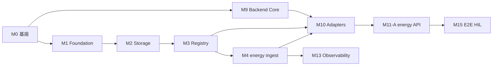

# G2 云端与后端 — 模块化任务分解 (Implementation Task Breakdown)

> **维护**: Agent 008  
> **版本**: v0.1 · 2026-05-29  
> **状态**: 执行蓝图 — 随 Phase 推进更新勾选状态  
> **读者**: Bob、008、007（固件 Topic 对齐）、后续前端/QA  
> **约束**: [`008_Strategic_Guide.md`](008_Strategic_Guide.md) · [`G2_Cloud_Architecture_Design.md`](G2_Cloud_Architecture_Design.md) · [`G2_API_Architecture_Draft.md`](../../02-backend/docs/G2_API_Architecture_Draft.md)

---

## 1. 文档用途

| 用途 | 说明 |
|------|------|
| **模块边界** | 将 G2 工作拆为可并行、可验收的 **Module（模块）** |
| **子任务** | 每模块下列出 **Sub-task（子任务）**，带 ID、依赖、产出物 |
| **阶段对齐** | 与架构文档 **P0–P5** 一致；MVP = **P0 + P1 + 合流 + HIL** |
| **不负责** | 固件实现细节 → `01-firmware/`（007）；前端 → `03-frontend/`（待建） |

**状态图例**: `⬜` 未开始 · `🔄` 进行中 · `✅` 完成 · `⏸` 方案待决 · `🚫` 明确不做（Legacy）

---

## 2. 模块总览

```text
┌─────────────────────────────────────────────────────────────────────────┐
│  M0 工程基座          09-contract · CDK 脚手架 · CI 门禁                 │
├─────────────────────────────────────────────────────────────────────────┤
│  M1 Foundation       KMS · SSM · IAM 模板 · IoT Policy 基类            │
│  M2 Storage            Timestream(5) · DDB Shadow · S3 Vision            │
│  M3 Registry           设备注册表 · track 路由 · Legacy 批量导入脚本      │
├─────────────────────────────────────────────────────────────────────────┤
│  M4 Ingest·energy      IoT Rule + Lambda + Schema（P1 MVP 核心）        │
│  M5 Ingest·network     RUT Topic + XOR 推导（P2）                       │
│  M6 Ingest·control     命令审计 ingest + dispatch（P3）                   │
│  M7 Ingest·vision      事件 + S3 元数据（P4）                             │
│  M8 Ingest·environment 传感器遥测（P5）                                   │
├─────────────────────────────────────────────────────────────────────────┤
│  M9  Backend·Core      FastAPI 骨架 · 配置 · 中间件                     │
│  M10 Backend·Adapters   Legacy/G2 双轨合流 · Registry 路由                │
│  M11 Backend·v2 API     Fleet / 五域 REST（按 Phase 递增）              │
│  M12 Backend·v1 Shim    MPPT SER# 兼容层（deprecated）                    │
├─────────────────────────────────────────────────────────────────────────┤
│  M13 Observability     Dashboard · Alarm · 结构化日志                    │
│  M14 API Gateway       域名 · 证书 · App Runner/Lambda 挂载（可选栈）     │
│  M15 E2E·HIL           dev 全链路验收 · HQ2513* g2 批次标识              │
├─────────────────────────────────────────────────────────────────────────┤
│  M16 Tenant·Auth       Cognito · RBAC · Customer/User（⏸ MVP 外）       │
│  M17 Commercial        SIM · Stripe · Provisioning（⏸ 待决）            │
│  M18 Advanced          Smart Backfill · GPS 融合 · WebRTC（⏸ 路线图）    │
└─────────────────────────────────────────────────────────────────────────┘
```

---

## 3. 阶段与模块映射

| Phase | 目标 | 主要模块 | MVP? |
|-------|------|----------|------|
| **P0** | IaC 基座 + 存储 + Registry 表 | M0, M1, M2, M3 | ✅ |
| **P1** | **energy**  ingest + v2 energy API + 合流 | M4, M9–M12（energy 子集）, M15 | ✅ |
| **P2** | **network** + POE XOR | M5, M11（network） | |
| **P3** | **control** + 审计 | M6, M11（control） | |
| **P4** | **vision** + S3 预签名 | M7, M11（vision） | |
| **P5** | **environment** + 多账号/DR | M8, M11（environment） | |
| **并行** | 可观测 + 网关 + CI | M13, M14, M0（CI） | P1 起建议并行 |
| **延后** | 租户 / 商用 / 高级特性 | M16–M18 | ⏸ |

---

## 4. 模块详表与子任务

### M0 — 工程基座 (Engineering Foundation)

**目录**: `09-contract/` · `04-cloud/cdk/` · `.github/workflows/`（待建）  
**依赖**: 无  
**产出**: 可 `cdk synth`；Schema 可被 Lambda 与 FastAPI 共用

| ID | 子任务 | 产出物 | 状态 |
|----|--------|--------|------|
| M0.1 | 初始化 `04-cloud/cdk/`（TypeScript CDK v2，`bin/app.ts`，`-c env=dev\|prod`） | CDK app 骨架 | ✅ |
| M0.2 | 创建 `09-contract/schemas/{domain}/` 目录约定 | README + 域占位 | ✅ |
| M0.3 | **energy** Payload JSON Schema v1（对齐 `01-firmware` payload 与 Domain Map） | `09-contract/schemas/energy/telemetry.v1.json` | ✅ |
| M0.4 | 从 FastAPI 导出 OpenAPI 流水线（脚本占位） | `09-contract/openapi/v2.yaml`（生成物） | ⬜ |
| M0.5 | GitHub Actions：`cdk synth` + `pytest`（backend 有代码后） | workflow yaml | ⬜ |
| M0.6 | dev/prod Context 文档化（禁止明文 Secret） | `cdk/cdk.json` + SSM 命名约定 | ⬜ |

---

### M1 — Foundation Stack (CDK)

**Stack**: `G2FoundationStack`  
**依赖**: M0.1  
**产出**: KMS、SSM 参数路径、共享 IAM 角色模板、IoT Policy 文档化 Construct

| ID | 子任务 | 产出物 | 状态 |
|----|--------|--------|------|
| M1.1 | `G2FoundationStack` 空栈部署 dev | CloudFormation 成功 | ✅ |
| M1.2 | KMS CMK（Timestream / S3 可选加密） | Key ARN in SSM | ✅ |
| M1.3 | SSM 参数：`/iqedge/g2/{env}/…` 层级约定 | 参数模板 | ✅ |
| M1.4 | `IoTThingPolicyConstruct`：五域 publish/subscribe 模板 | CDK Construct + 文档 | ✅ |
| M1.5 | 共享 Lambda 执行角色模板（最小权限基类） | `iqedge-g2-{env}-role-lambda-base` | ✅ |

---

### M2 — Storage Stack (CDK)

**Stack**: `G2StorageStack`  
**依赖**: M1  
**产出**: Timestream DB + 5 tables、DDB Shadow、S3 vision bucket

| ID | 子任务 | 产出物 | 状态 |
|----|--------|--------|------|
| M2.1 | Timestream DB `iqedge_g2_{env}_database` | AWS 资源 | ✅ |
| M2.2 | 五张域表（`table_energy` … `table_control_logs`）保留策略 | 5 tables | ✅ |
| M2.3 | DDB `iqedge-g2-{env}-table-shadow`（PK/SK 设计见 System Model） | 表（GSI 延后） | ✅ |
| M2.4 | S3 `iqedge-g2-{env}-vision-assets` + lifecycle | Bucket 策略 | ✅ |
| M2.5 | DDB `table_control_logs`（control 审计，可与 M6 联调） | 表结构 | ✅ |

---

### M3 — Registry (CDK + 运维脚本)

**Stack**: `G2RegistryStack`  
**依赖**: M2（可与 M2 同栈或独立，按 Cloud Design）  
**产出**: 设备注册表、track=g2\|legacy 路由依据

| ID | 子任务 | 产出物 | 状态 |
|----|--------|--------|------|
| M3.1 | DDB `iqedge-g2-{env}-table-registry` | 表 + GSI | ✅ |
| M3.2 | Registry 项 JSON Schema（sys_id, system_type, components, track, aliases） | `09-contract/schemas/registry/` | ✅ |
| M3.3 | Legacy ~70 台 **只读批量导入**脚本（不改老表） | `04-cloud/scripts/import_legacy_registry.py` | ✅ 脚手架 |
| M3.4 | `track=g2` 判定规则落地（固件 ≥v2.3.0 · 晋升仅人工） | [`G2_Registry_Track_Assignment_SOP.md`](G2_Registry_Track_Assignment_SOP.md) · ADR-008 | ✅ |
| M3.5 | Provisioning Hook Lambda 占位（扫码写 Registry — 与 M17 联动） | 可选 Lambda | ⏸ |

---

### M4 — Ingest: energy 域 (P1 MVP)

**Stack**: `G2IngestStack`（可先仅 energy Construct）  
**依赖**: M2, M3, M0.3, **007** Topic `iqedge/g2/{env}/energy/telemetry`  
**产出**: Rule + Lambda + Timestream/Shadow 双写

| ID | 子任务 | 产出物 | 状态 |
|----|--------|--------|------|
| M4.1 | IoT Rule `iqedge_g2_{env}_rule_energy`（**禁止 `#`**） | Rule | ✅ dev |
| M4.2 | Lambda `iqedge-g2-{env}-fn-ingest-energy` | 函数 + IAM | ✅ dev |
| M4.3 | Ingest：JSON Schema 校验 → Timestream WriteRecords | 写入成功指标 | ✅ |
| M4.4 | Ingest：更新 Shadow 最新快照（DDB） | shadow 延迟可测 | ✅ |
| M4.5 | 结构化日志（deviceId/sys_id, domain, latency_ms） | Log 样例 | ✅ |
| M4.6 | CloudWatch 指标 `IngestSuccess` / `IngestValidationError` | 指标 | ✅ |
| M4.7 | dev HIL：测试 Thing 发 1 条 telemetry → 可在 Timestream 查到 | 验收记录 | ✅ IQ-26-00001 · v2.3.003 |

---

### M5 — Ingest: network 域 (P2)

**依赖**: M4 模式复用、`DomainIngestPipeline` Construct  
**关联**: [`G2_GPS_Fusion_And_Tracking_Open_Issues.md`](G2_GPS_Fusion_And_Tracking_Open_Issues.md)（⏸）

| ID | 子任务 | 产出物 | 状态 |
|----|--------|--------|------|
| M5.1 | Rule + Lambda ingest `…/network/telemetry` | 管道 | ⬜ |
| M5.2 | Legacy `iot/rut241/*` **不改造**；新设备走 G2 Topic | 文档声明 | ✅ 战略 |
| M5.3 | `fn-network-xor` 定时推导（RUT 在线 ⊕ PoE ⊕ load 异常） | Lambda + 告警 | ⬜ |
| M5.4 | Timestream 历史缺口标注（审计 2026-03~04） | 运维注记 | ⬜ |

---

### M6 — Ingest & Dispatch: control 域 (P3)

| ID | 子任务 | 产出物 | 状态 |
|----|--------|--------|------|
| M6.1 | Rule ingest `…/control/command`（审计日志） | audit 写入 | ⬜ |
| M6.2 | `fn-control-dispatch`：API/内部 → IoT publish / Jobs | dispatch Lambda | ⬜ |
| M6.3 | `control_logs` 写入 actor_user_id（与租户 ⏸ 预留字段） | DDB 记录 | ⬜ |
| M6.4 | OTA vs `play_audio` / 继电器 **命令白名单**文档（Bob 待决） | ADR | ⏸ |

---

### M7 — Ingest: vision 域 (P4)

| ID | 子任务 | 产出物 | 状态 |
|----|--------|--------|------|
| M7.1 | Rule ingest `…/vision/event` | 管道 | ⬜ |
| M7.2 | VQA telemetry `…/vision/telemetry`（focus_blur 等） | 管道 | ⬜ |
| M7.3 | 图片/片段元数据 → S3；Timestream 只存指标 | 不上传二进制到 TS | ⬜ |
| M7.4 | IQCamera Legacy 共存迁移策略（**Bob 待决**） | 迁移 ADR | ⏸ |
| M7.5 | Smart Backfill ingest 路径（`ingest_mode=backfill`） | 见 Backfill 文档 | ⏸ |

---

### M8 — Ingest: environment 域 (P5)

| ID | 子任务 | 产出物 | 状态 |
|----|--------|--------|------|
| M8.1 | Rule + Lambda `…/environment/telemetry` | 管道 | ⬜ |
| M8.2 | Modbus 传感器 payload Schema | contract | ⬜ |

---

### M9 — Backend: Core (FastAPI)

**目录**: `02-backend/app/`  
**依赖**: M0.1（本地开发可先 mock AWS）

| ID | 子任务 | 产出物 | 状态 |
|----|--------|--------|------|
| M9.1 | `pyproject.toml` + FastAPI + uvicorn + boto3 + pydantic | 依赖锁定 | ⬜ |
| M9.2 | `app/main.py` app factory；`config.py` env/region | 可启动 | ⬜ |
| M9.3 | `GET /status` → `"ok"` | 健康检查 | ⬜ |
| M9.4 | `middleware/request_id.py` | 请求追踪 | ⬜ |
| M9.5 | `middleware/auth.py` — MVP API Key（SSM 读取） | dev 鉴权 | ⬜ |
| M9.6 | `services/timestream.py` · `services/dynamodb.py` 客户端封装 | service 层 | ⬜ |
| M9.7 | `Dockerfile`（App Runner / ECS 就绪） | 容器构建 | ⬜ |

---

### M10 — Backend: 双轨合流 Adapters

**依赖**: M3, M9, Legacy 审计数据路径  
**战略**: [`008_Strategic_Guide.md`](008_Strategic_Guide.md) §3

| ID | 子任务 | 产出物 | 状态 |
|----|--------|--------|------|
| M10.1 | `adapters/registry.py`：sys_id / mppt_serial → track | 路由单元测试 | ⬜ |
| M10.2 | `adapters/legacy_energy.py`：读 `DeviceLatestStatus` + 老 Wh/kWh 算法 | adapter | ⬜ |
| M10.3 | `adapters/g2_energy.py`：Timestream 查询 + **÷1000.0** kWh | adapter | ⬜ |
| M10.4 | 对外统一 Pydantic models（G2 schema；Legacy 内部转换） | `models/energy.py` | ⬜ |
| M10.5 | 合流集成测试：同一 `sys_id` 在 legacy/g2 各测一条 | pytest | ⬜ |

---

### M11 — Backend: v2 Fleet API（按域递增）

**依赖**: M10  
**规范**: [`G2_API_Architecture_Draft.md`](../../02-backend/docs/G2_API_Architecture_Draft.md)

#### M11-A — P0/P1（MVP）

| ID | 子任务 | 端点 / 能力 | 状态 |
|----|--------|-------------|------|
| M11.A1 | `GET /api/v2/meta` | 版本信息 | ⬜ |
| M11.A2 | `GET /api/v2/fleet/systems` | 列表 + 过滤 | ⬜ |
| M11.A3 | `GET /api/v2/fleet/systems/{sys_id}` | 元数据 + components | ⬜ |
| M11.A4 | `GET .../energy` | 域快照 | ⬜ |
| M11.A5 | `GET .../energy/history` | 时序（默认 max 7d 窗） | ⬜ |
| M11.A6 | 错误体：`error` + `error_description` | 统一异常处理器 | ⬜ |

#### M11-B — P2 network

| ID | 子任务 | 状态 |
|----|--------|------|
| M11.B1 | `GET .../network` · `.../network/history` | ⬜ |
| M11.B2 | 路由器 component 子资源（若 Schema 就绪） | ⬜ |

#### M11-C — P3 control

| ID | 子任务 | 状态 |
|----|--------|------|
| M11.C1 | `POST .../control/command` | ⬜ |
| M11.C2 | 命令审计查询 API（可选） | ⬜ |

#### M11-D — P4 vision

| ID | 子任务 | 状态 |
|----|--------|------|
| M11.D1 | `GET .../vision/events` | ⬜ |
| M11.D2 | VQA health · presigned URL | ⬜ |
| M11.D3 | `POST .../vision/webrtc/offer`（Talk-down，⏸ 细节待决） | ⏸ |

#### M11-E — P5 environment

| ID | 子任务 | 状态 |
|----|--------|------|
| M11.E1 | `GET .../environment` · history | ⬜ |

---

### M12 — Backend: v1 Legacy Shim

| ID | 子任务 | 产出物 | 状态 |
|----|--------|--------|------|
| M12.1 | `GET /v1/devices/{mppt_serial}/status` → legacy adapter | deprecated 头 | ⬜ |
| M12.2 | OpenAPI 标记 v1 deprecated；Sunset 日期待 Bob | 文档 | ⏸ |

---

### M13 — Observability (CDK)

**Stack**: `G2ObservabilityStack`  
**依赖**: M4+

| ID | 子任务 | 产出物 | 状态 |
|----|--------|--------|------|
| M13.1 | 五域 Ingest Dashboard（rate / error / shadow lag） | CW Dashboard | ⬜ |
| M13.2 | Timestream rejected → SNS Alarm | 告警 | ⬜ |
| M13.3 | 5min 零 ingest Warning（按域） | 告警 | ⬜ |
| M13.4 | X-Ray on Lambda（dev 默认，prod 可选） | 追踪 | ⬜ |

---

### M14 — API Gateway & 部署挂载

**Stack**: `G2ApiStack`（可选）  
**依赖**: M9

| ID | 子任务 | 产出物 | 状态 |
|----|--------|--------|------|
| M14.1 | Bob 决策：App Runner vs Lambda HTTP API vs ECS | ADR | ⏸ |
| M14.2 | 自定义域名 + ACM 证书（dev/prod） | Route53/ACM | ⬜ |
| M14.3 | API Gateway → App Runner（或 ALB） | 仅网关，无业务逻辑 | ⬜ |

---

### M15 — E2E / HIL 验收

**依赖**: P0+P1 完成，007 dev 设备或合成 Thing

| ID | 子任务 | 验收标准 | 状态 |
|----|--------|----------|------|
| M15.1 | dev：`cdk deploy -c env=dev` 全栈 | 无人工 Console 操作 | ⬜ |
| M15.2 | MQTT → Timestream → `GET .../energy` 端到端 < 60s | 记录延迟 | ⬜ |
| M15.3 | Legacy 设备经 v1 + 合流仍可读 | 回归 | ⬜ |
| M15.4 | 新批次 `HQ2513*` 标记 `track=g2` 仅走 G2 管道 | Registry 验收 | ⬜ |

---

### M16 — Tenant & Auth（⏸ MVP 外）

**参考**: [`G2_Client_Tenant_Model.md`](G2_Client_Tenant_Model.md) · [`G2_Customer_User_Frontend_Blueprint.md`](G2_Customer_User_Frontend_Blueprint.md)

| ID | 子任务 | 状态 |
|----|--------|------|
| M16.1 | Cognito User Pool + JWT claims（dealer_id, customer_id, user_id, role） | ⏸ |
| M16.2 | Auth 中间件 Scope 校验 | ⏸ |
| M16.3 | Tenant CRUD API（customers, invitations） | ⏸ |
| M16.4 | 多租户 sys_id 列表过滤（隐私隔离） | ⏸ |

---

### M17 — Commercial & Provisioning（⏸ 待决）

**参考**: [`G2_SIM_Provisioning_Deadlock.md`](G2_SIM_Provisioning_Deadlock.md)

| ID | 子任务 | 状态 |
|----|--------|------|
| M17.1 | `POST .../fleet/systems/{sys_id}/activate` 流程定稿 | ⏸ |
| M17.2 | 运营商 API 集成（流量 OPEX 保护） | ⏸ |
| M17.3 | Stripe Customer Portal 嵌入（Dealer/Client 计费） | ⏸ |

---

### M18 — Advanced / 路线图（⏸）

| ID | 子任务 | 参考文档 | 状态 |
|----|--------|----------|------|
| M18.1 | Smart Backfill 云端 ingest | `G2_Smart_Backfill_Architecture.md` | ⏸ |
| M18.2 | GPS 双源融合 + Tracking FSM | `G2_GPS_Fusion_And_Tracking_Open_Issues.md` | ⏸ |
| M18.3 | 多 AWS 账号 Landing Zone | Cloud Design §9 | ⏸ |
| M18.4 | Rate limit / Billing tier | API Draft §10 | ⏸ |

---

## 5. MVP 关键路径（Critical Path）



**最短可交付序列（建议 Bob 排期）**:

1. M0.1 → M1 → M2 → M3.1–M3.3  
2. 并行：M0.3 + M9.1–M9.3 + M10.1  
3. M4 全条 + M10.2–M10.5 + M11.A1–A6 + M12.1  
4. M15 验收 → 宣布 MVP  

**已完成（不计入 MVP 工时）**:

- ✅ Legacy `Route_Energy_To_Lambda`（`#` catch-all）已禁用（2026-05-29）

---

## 6. 跨团队依赖（007 / Bob）

| 依赖方 | 事项 | 阻塞模块 |
|--------|------|----------|
| **007** | G2 MQTT Topic 五域对齐，尤其 `energy/telemetry` payload | M4, M15 |
| **007** | `deployment_state` 状态机与云端字段一致 | M3, M11 |
| **Bob** | `track=g2` 判定规则 | M3.4 |
| **Bob** | 02-backend 部署形态（M14.1） | M14 |
| **Bob** | MVP 鉴权：API Key only vs Cognito | M9.5, M16 |
| **Bob** | Phase 0 开工批准 + dev 账号 deploy 权限 | M0–M2 |

---

## 7. 明确不做（008 边界）

| 项 | 原因 |
|----|------|
| 改造 `DeviceStatusToLambda` / `DeviceLatestStatus` | 双轨战略 |
| 迁移 70 台老设备固件到 G2 Topic | 007/Bob 决策，非 008 强推 |
| IoT Rule `topic #` | Legacy 审计反模式 |
| Phase 1 实现完整 Tenant/Stripe | M16/M17 延后 |
| 在 Timestream 存 vision 二进制 | Cloud Design 非目标 |

---

## 8. 建议迭代节奏（参考，非承诺工期）

| 迭代 | 模块焦点 | 建议周期 |
|------|----------|----------|
| Sprint 0 | M0 + M1 + M2 | 1 周 |
| Sprint 1 | M3 + M4 + M9 + M10（energy） | 1–2 周 |
| Sprint 2 | M11-A + M12 + M15 | 1 周 |
| Sprint 3 | M5 + M11-B + M13 | 1–2 周 |
| Sprint 4+ | M6–M8 + M11-C~E | 按域 |

---

## 9. 文档索引

| 文档 | 关系 |
|------|------|
| [`00-strategy/docs/IQCLOUD_COMMERCIAL_STRATEGY.md`](../../00-strategy/docs/IQCLOUD_COMMERCIAL_STRATEGY.md) | 商业价值 → 优先级依据 |
| [`G2_Cloud_Architecture_Design.md`](G2_Cloud_Architecture_Design.md) | Stack 拆分 · P0–P5 |
| [`G2_API_Architecture_Draft.md`](../../02-backend/docs/G2_API_Architecture_Draft.md) | 端点 · 代码结构 |
| [`G2_System_Model.md`](../../02-backend/docs/G2_System_Model.md) | sys_id · Registry JSON |
| [`G2_Domain_Map.md`](G2_Domain_Map.md) | 命名宪法 |
| [`cloud_backend_log.md`](cloud_backend_log.md) | 决策变更日志 |

---

## 10. 变更记录

| 日期 | 变更 |
|------|------|
| 2026-05-29 | v0.1 初版：M0–M18 模块与子任务分解 |

---

*Agent 008 · G2 Cloud & Backend Task Breakdown · v0.1*
